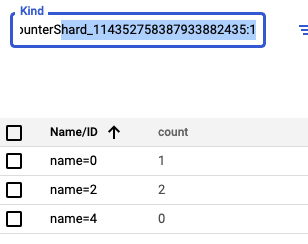

# Projet TinyGram - Web, Cloud & Datastores
Malo GRALL, Mathis ROCHER, Guillaume POIGNANT

## Applications
- [Application web](http://univ-cloud.ew.r.appspot.com/)
- REST API : https://endpointsportal.tinycrash.cloud.goog/
- [Github](https://github.com/grallm/m1-google-cloud/)
  - [README](https://github.com/grallm/m1-google-cloud/blob/main/README.md)

### Technologies utilisées
#### Frontend
- NextJS
- Google App Engine (host)

#### Backend
- Google Endpoints Framework
- Google Datastore
- Google Cloud Storage

## Kinds
### User

### Post

### Like

### Sharded Counter

## Benchmark - Performances

## Commentaires
### Frontend
Cherchant à fournir la meilleure expérience pour nos utilisateurs, nous avons décidé d'utiliser le framework `NextJS`, basé sur `ReactJS`.

Ce choix fut fait par notre connaissance de React et des outils associés, mais aussi pour les performances que propose `NextJS`.

Nous avons choisi d'utiliser Compute Engine pour héberger le front, car c'est un VM classique et simple d'utilisation qui répondais a tous nos besoins. 

### Google Endpoint Framework

Nous avons choisi d'utiliser Google Endpoint Framework, car les outils google sont intégrés de base. Ce qui nous a permis 
de mettre en place le back end ainsi que la definition de nos routes d'API simplement et rapidement.

La connexion au datastore nous a ete facilite et nous n'avons pas eu besoin de gérer la serialization puisque Google Endpoint gere ça automatiquement. 

En plus de cela il contient un middleware intégré qui nous a permis d'utiliser les tokens de connexions facilement afin de verifier
si le user était bien connecté a tout moment.

## Difficultés et Solutions
### Frontend
NextJS nécessitant un serveur NodeJS, n'étant pas statique, il nous fallait héberger le serveur frontend autre part.

Les solutions idéales auraient été `Cloud Run` ou encore `Compute Engine`, mais malheureusement ces solutions ne proposant qu'une IP et aucun DNS, `API Credentials` n'autorisait pas ces URL pour la connexion avec Google.

Nous avons aussi remarqué que sans comprendre pourquoi, le déploiement effectué sur `App Engine` fournissait une application web non fonctionnelle.

### Gestion des images

Dû à notre utilisation de l'App Engine ainsi que de Google Endpoint la gestion des images a ete plus complexe que prévu. 

Pour la gestion des images nous avons utilisé Google Cloud Storage. À partir du front nous envoyons un string contenant
l'image en Base64 que nous récupérons en back pour la parser puis la convertir en image à l'aide du service google `ImageServiceFactory.makeImage(byte[])`.

Ensuite nous créons un `Blob` qui va contenir notre image ainsi qu'un nom et enfin on le publie sur le Cloud Storage 
et on récupère le lien du blob pour le mettre dans notre entity `Post` et y avoir accès en front.

### Like scalables 
Pour développer nos likes nous avons utilisé des `Entity` ainsi que des `ShardedCounters` et transaction expliquer 
pourquoi c'est safe et avantage, mais aussi désavantages

### Timeline
Afin d'obtenir une timeline efficace, nous avons dû itérer plusieurs fois.

- Dans un premier temps nous avions une premiere requête qui récupérais les entités follow liées au User puis les ajoutais 
a une liste et enfin nous récupérions tous les posts des utilisateurs dans la liste de followings.
Mais le `Query.FilterOperator.IN` est limité à 30 sous requêtes donc nous ne récupérions que 30 posts. 

- Dans un second temps nous nous sommes débarrassé de l'entité `Follow` pour n'utiliser que des listes et des objets java 
accompagnés d'un comparator pour les trier. Mais cette solution a tres vite vu ses limites puisque la manipulation de liste 
d'objets en java est tres couteuse en temps.
De plus pour le front ne plus utiliser d'entités `Post` et seulement des listes d'objets Java nous pénalisais.

- Enfin nous avons fait un mix des deux. Notre User a une liste de followings que l'on va récupérer pour obtenir les posts
vieux de maximum 1 jour afin d'avoir une timeline "intelligente" enfin nous récupérons la date des posts que nous trions avec notre
comparator afin d'avoir le post le plus récent en premier. En plus de ça a la fin des posts de notre timeline nous affichons une 
série de posts afin que l'utilisateur ai quelque chose à voir.

## Améliorations
Nous avons plusieurs idees d'améliorations :
- Une recherche d'utilisateur plus poussée qui nous permettrait de suggérer des utilisateurs à chaque caractère rentre dans la barre de
recherche. Actuellement la recherche est case sensitive et nous devons appuyer sur entree pour effectuer la recherche, mais elle nous suggère 
des utilisateurs qui commence par la chaine de caractère entré.
- Une liste des personnes qui ont like un post.
- Une liste de nos abonnés et de nos abonnements.
- Ajouter des commentaires a un post.
- Actuellement notre timeline est limitée à 20 posts, il faudrait donc une pagination pour afficher davantage de posts.
